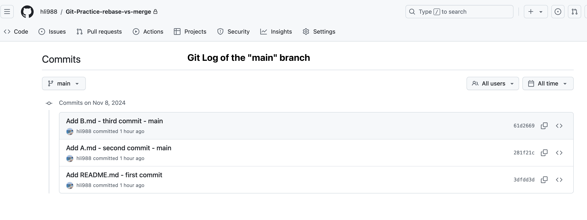
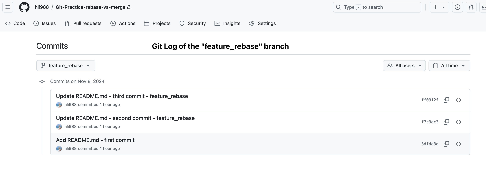
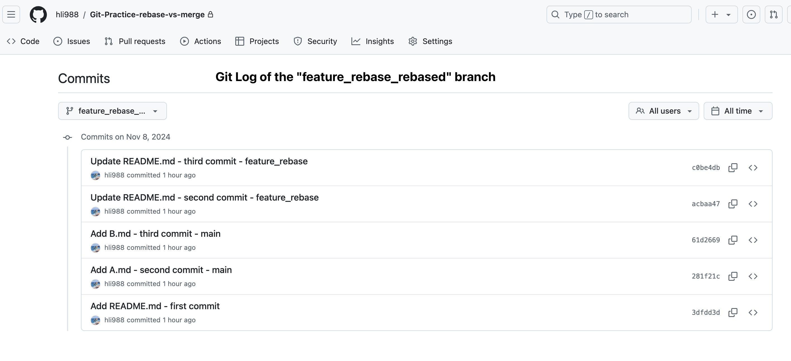

# Git Log: Rebase

<blockquote>
Table of Contents

- [Git Log: Rebase](#git-log-rebase)
  - [1. Create branches `main` and `feature_rebase`](#1-create-branches-main-and-feature_rebase)
  - [2. Work on `feature_rebase` branch](#2-work-on-feature_rebase-branch)
    - [Commit history of updated `feature_rebase` branch](#commit-history-of-updated-feature_rebase-branch)
  - [3. Push changes from `feature_rebase` to the remote](#3-push-changes-from-feature_rebase-to-the-remote)
  - [4. Work on `main` branch and Push to remote](#4-work-on-main-branch-and-push-to-remote)
    - [Commit history of updated `main` branch](#commit-history-of-updated-main-branch)
  - [5. Rebase `feature_rebase` onto `main`](#5-rebase-feature_rebase-onto-main)
    - [Commit history of rebased `feature_rebase` branch](#commit-history-of-rebased-feature_rebase-branch)
  - [6. Create a new branch `feature_rebase_rebased` branch](#6-create-a-new-branch-feature_rebase_rebased-branch)
  - [7. Final git log of all branches](#7-final-git-log-of-all-branches)
    - [a. Git Log of the `main` branch](#a-git-log-of-the-main-branch)
    - [b. Git Log of the `feature_rebase` branch](#b-git-log-of-the-feature_rebase-branch)
    - [c. Git Log of the `feature_rebase_rebased` branch](#c-git-log-of-the-feature_rebase_rebased-branch)
    </blockquote>


## 1. Create branches `main` and `feature_rebase`
1. Clone the project
2. On `main` branch, create `README.md` file

    ```console
    Last login: Thu Nov  7 22:50:19 on ttys002

    ~/GitHub main*
    ❯ git clone https://github.com/hli988/Git-Practice-rebase-vs-merge.git
    Cloning into 'Git-Practice-rebase-vs-merge'...
    warning: You appear to have cloned an empty repository.

    ~/GitHub main*
    ❯ cd Git-Practice-rebase-vs-merge 

    ~/GitHub/Git-Practice-rebase-vs-merge main
    ❯ ls

    ~/GitHub/Git-Practice-rebase-vs-merge main
    ❯ vi README.md
    ```

3. Commit the change
4. Push the first commit from `main` to `remotes/origin/main`
    ```console
    ~/GitHub/Git-Practice-rebase-vs-merge main*
    ❯ git add .                  
    
    ~/GitHub/Git-Practice-rebase-vs-merge main*
    ❯ git commit -m "Add README.md - first commit"
    [main (root-commit) 3dfdd3d] Add README.md - first commit
    1 file changed, 2 insertions(+)
    create mode 100644 README.md
    
    ~/GitHub/Git-Practice-rebase-vs-merge main
    ❯ git push                                    
    Enumerating objects: 3, done.
    Counting objects: 100% (3/3), done.
    Writing objects: 100% (3/3), 259 bytes | 259.00 KiB/s, done.
    Total 3 (delta 0), reused 0 (delta 0), pack-reused 0
    To https://github.com/hli988/Git-Practice-rebase-vs-merge.git
    * [new branch]      main -> main
    ```

5. On `main` branch, checkout to a new branch `feature_rebase`
6. Check its log, it should be identical to the git log of `main`
7. Checkout to `main` branch, to compare the git log

    ```console
    ~/GitHub/Git-Practice-rebase-vs-merge main
    ❯ git checkout -b feature_rebase
    Switched to a new branch 'feature_rebase'
    
    ~/GitHub/Git-Practice-rebase-vs-merge feature_rebase
    ❯ git log                       
    commit 3dfdd3db1d031915ef4ebf0a5a973312b7ed5dd9 (HEAD -> feature_rebase, origin/main, main)
    Author: hao <lihaocaleo@gmail.com>
    Date:   Fri Nov 8 15:54:53 2024 -0700
    
        Add README.md - first commit
    
    ~/GitHub/Git-Practice-rebase-vs-merge feature_rebase
    ❯ git checkout main             
    Switched to branch 'main'
    Your branch is up to date with 'origin/main'.
    
    ~/GitHub/Git-Practice-rebase-vs-merge main
    ❯ git log          
    commit 3dfdd3db1d031915ef4ebf0a5a973312b7ed5dd9 (HEAD -> main, origin/main, feature_rebase)
    Author: hao <lihaocaleo@gmail.com>
    Date:   Fri Nov 8 15:54:53 2024 -0700
    
        Add README.md - first commit
    ```


- Now, there are 2 branches both containing 1 commit “Add README.md - first commit”
  - `main` 
  -  `feature_rebase` 
---
## 2. Work on `feature_rebase` branch
1. On `feature_rebase` branch, update `README.md` file
2. Commit the change (the second commit from `feature_rebase`)

    ```console
    ~/GitHub/Git-Practice-rebase-vs-merge main
    ❯ git checkout feature_rebase
    Switched to branch 'feature_rebase'

    ~/GitHub/Git-Practice-rebase-vs-merge feature_rebase
    ❯ git log   
    commit 3dfdd3db1d031915ef4ebf0a5a973312b7ed5dd9 (HEAD -> feature_rebase, origin/main, main)
    Author: hao <lihaocaleo@gmail.com>
    Date:   Fri Nov 8 15:54:53 2024 -0700

        Add README.md - first commit

    ~/GitHub/Git-Practice-rebase-vs-merge feature_rebase
    ❯ vi README.md 

    ~/GitHub/Git-Practice-rebase-vs-merge feature_rebase* 16s
    ❯ git status
    On branch feature_rebase
    Changes not staged for commit:
      (use "git add <file>..." to update what will be committed)
      (use "git restore <file>..." to discard changes in working directory)
      modified:   README.md

    no changes added to commit (use "git add" and/or "git commit -a")

    ~/GitHub/Git-Practice-rebase-vs-merge feature_rebase*
    ❯ git add . 

    ~/GitHub/Git-Practice-rebase-vs-merge feature_rebase*
    ❯ git commit -m "Update README.md - second commit - feature_rebase"
    [feature_rebase f7c9dc3] Update README.md - second commit - feature_rebase
    1 file changed, 1 insertion(+)

    ~/GitHub/Git-Practice-rebase-vs-merge feature_rebase
    ❯ git log                                                          
    commit f7c9dc38c5d1cfc8b9a1280609048b8f9cbedcaa (HEAD -> feature_rebase)
    Author: hao <lihaocaleo@gmail.com>
    Date:   Fri Nov 8 15:57:08 2024 -0700

        Update README.md - second commit - feature_rebase

    commit 3dfdd3db1d031915ef4ebf0a5a973312b7ed5dd9 (origin/main, main)
    Author: hao <lihaocaleo@gmail.com>
    Date:   Fri Nov 8 15:54:53 2024 -0700

        Add README.md - first commit

    ```

3. Update `README.md` file again

4. Commit the change (the thrid commit from `feature_rebase`)

    ```console
    ~/GitHub/Git-Practice-rebase-vs-merge feature_rebase
    ❯ vi README.md                                                     
    
    ~/GitHub/Git-Practice-rebase-vs-merge feature_rebase* 37s
    ❯ git add .                                                        
    
    ~/GitHub/Git-Practice-rebase-vs-merge feature_rebase*
    ❯ git commit -m "Update README.md - third commit - feature_rebase"
    [feature_rebase ff0912f] Update README.md - third commit - feature_rebase
    1 file changed, 1 insertion(+)
    
    ~/GitHub/Git-Practice-rebase-vs-merge feature_rebase
    ❯ git log                                                         
    commit ff0912fac08e1f250642e7a8c2a7c6ec4fbf1ef0 (HEAD -> feature_rebase)
    Author: hao <lihaocaleo@gmail.com>
    Date:   Fri Nov 8 15:58:09 2024 -0700
    
        Update README.md - third commit - feature_rebase
    
    commit f7c9dc38c5d1cfc8b9a1280609048b8f9cbedcaa
    Author: hao <lihaocaleo@gmail.com>
    Date:   Fri Nov 8 15:57:08 2024 -0700
    
        Update README.md - second commit - feature_rebase
    
    commit 3dfdd3db1d031915ef4ebf0a5a973312b7ed5dd9 (origin/main, main)
    Author: hao <lihaocaleo@gmail.com>
    Date:   Fri Nov 8 15:54:53 2024 -0700
    
        Add README.md - first commit
    ```

### Commit history of updated `feature_rebase` branch
- Now, on `feature_rebase` branch, there are 3 commits.

  - Update README.md - third commit - feature_rebase (ff0912f)
  - Update README.md - second commit - feature_rebase (f7c9dc3)
  - Add README.md - first commit (3dfdd3d)

---

## 3. Push changes from `feature_rebase` to the remote
1. Push local branch `feature_rebase` to the remote, this will create a remote branch `remotes/origin/feature_rebase`

    ```console
    ~/GitHub/Git-Practice-rebase-vs-merge feature_rebase
    ❯ git branch       
    * feature_rebase
      main
    
    ~/GitHub/Git-Practice-rebase-vs-merge feature_rebase
    ❯ git branch -r                                             
      origin/main
    
    ~/GitHub/Git-Practice-rebase-vs-merge feature_rebase
    ❯ git push -u origin feature_rebase
    
    Enumerating objects: 8, done.
    Counting objects: 100% (8/8), done.
    Delta compression using up to 12 threads
    Compressing objects: 100% (4/4), done.
    Writing objects: 100% (6/6), 602 bytes | 602.00 KiB/s, done.
    Total 6 (delta 1), reused 0 (delta 0), pack-reused 0
    remote: Resolving deltas: 100% (1/1), done.
    remote: 
    remote: Create a pull request for 'feature_rebase' on GitHub by visiting:
    remote:      https://github.com/hli988/Git-Practice-rebase-vs-merge/pull/new/feature_rebase
    remote: 
    To https://github.com/hli988/Git-Practice-rebase-vs-merge.git
    * [new branch]      feature_rebase -> feature_rebase
    branch 'feature_rebase' set up to track 'origin/feature_rebase'.
    
    ~/GitHub/Git-Practice-rebase-vs-merge feature_rebase
    ❯ git branch -a
    * feature_rebase
      main
      remotes/origin/feature_rebase
      remotes/origin/main
    
    ~/GitHub/Git-Practice-rebase-vs-merge feature_rebase
    ❯ git branch -vv
    * feature_rebase ff0912f [origin/feature_rebase] Update README.md - third commit - feature_rebase
      main           3dfdd3d [origin/main] Add README.md - first commit
    
    ~/GitHub/Git-Practice-rebase-vs-merge feature_rebase
    ❯ git push                         
    Everything up-to-date
    ```

- Now, for the remote, it will have all the changes/updates from local

---
## 4. Work on `main` branch and Push to remote

1. On `main` branch, print log. There is only one commit on `main` branch.
2. Create `A.md` file and Commit the change (the second commit from `main`)
3. Create `B.md` file and Commit the change (the third commit from `main`)
4. Push the new commits from `main` to `remotes/origin/main`
5. Print log of `main` branch

    ```console
    ~/GitHub/Git-Practice-rebase-vs-merge feature_rebase
    ❯ git checkout main                                               
    Switched to branch 'main'
    Your branch is up to date with 'origin/main'.
    
    ~/GitHub/Git-Practice-rebase-vs-merge main
    ❯ git log          
    commit 3dfdd3db1d031915ef4ebf0a5a973312b7ed5dd9 (HEAD -> main, origin/main)
    Author: hao <lihaocaleo@gmail.com>
    Date:   Fri Nov 8 15:54:53 2024 -0700
    
        Add README.md - first commit
    
    ~/GitHub/Git-Practice-rebase-vs-merge main
    ❯ ls     
    README.md
    
    ~/GitHub/Git-Practice-rebase-vs-merge main
    ❯ git touch A.md
    git: 'touch' is not a git command. See 'git --help'.
    
    ~/GitHub/Git-Practice-rebase-vs-merge main
    ❯ touch A.md    
    
    ~/GitHub/Git-Practice-rebase-vs-merge main*
    ❯ git add A.md  
    
    ~/GitHub/Git-Practice-rebase-vs-merge main*
    ❯ git commit -m "Add A.md - second commit - main"
    [main 281f21c] Add A.md - second commit - main
    1 file changed, 0 insertions(+), 0 deletions(-)
    create mode 100644 A.md
    
    ~/GitHub/Git-Practice-rebase-vs-merge main ⇡
    ❯ touch B.md
    
    ~/GitHub/Git-Practice-rebase-vs-merge main* ⇡
    ❯ git add B.md                                   
    
    ~/GitHub/Git-Practice-rebase-vs-merge main* ⇡
    ❯ git commit -m "Add B.md - third commit - main"
    [main 61d2669] Add B.md - third commit - main
    1 file changed, 0 insertions(+), 0 deletions(-)
    create mode 100644 B.md
    
    ~/GitHub/Git-Practice-rebase-vs-merge main ⇡
    ❯ git push                                      
    Enumerating objects: 6, done.
    Counting objects: 100% (6/6), done.
    Delta compression using up to 12 threads
    Compressing objects: 100% (4/4), done.
    Writing objects: 100% (5/5), 451 bytes | 451.00 KiB/s, done.
    Total 5 (delta 1), reused 0 (delta 0), pack-reused 0
    remote: Resolving deltas: 100% (1/1), done.
    To https://github.com/hli988/Git-Practice-rebase-vs-merge.git
      3dfdd3d..61d2669  main -> main
    
    ~/GitHub/Git-Practice-rebase-vs-merge main
    ❯ git log 
    commit 61d2669ebae55d025e9ef9123e6165df61e47dea (HEAD -> main, origin/main)
    Author: hao <lihaocaleo@gmail.com>
    Date:   Fri Nov 8 16:05:07 2024 -0700
    
        Add B.md - third commit - main
    
    commit 281f21c5a49162eed26dfee4ae3c41fd8549d552
    Author: hao <lihaocaleo@gmail.com>
    Date:   Fri Nov 8 16:04:41 2024 -0700
    
        Add A.md - second commit - main
    
    commit 3dfdd3db1d031915ef4ebf0a5a973312b7ed5dd9
    Author: hao <lihaocaleo@gmail.com>
    Date:   Fri Nov 8 15:54:53 2024 -0700
    
        Add README.md - first commit
    
    ```

### Commit history of updated `main` branch
- Now, on `main` branch, there are 3 commits.

  - Add B.md - third commit - main (61d2669)
  - Add A.md - second commit - main (281f21c)
  - Add README.md - first commit (3dfdd3d)

---
## 5. Rebase `feature_rebase` onto `main`
It’s time to rebase `feature_rebase` branch onto `main` branch
1. On `feature_rebase` branch, call `git rebase main`
2. Check the log

    ```console
    ~/GitHub/Git-Practice-rebase-vs-merge feature_rebase
    ❯ git checkout feature_rebase
    Already on 'feature_rebase'
    Your branch is up to date with 'origin/feature_rebase'.
    
    ~/GitHub/Git-Practice-rebase-vs-merge feature_rebase
    ❯ git rebase main                                    
    Successfully rebased and updated refs/heads/feature_rebase.
    
    ~/GitHub/Git-Practice-rebase-vs-merge feature_rebase ⇣⇡
    ❯ git log        
    commit c0be4dbd099cfbc09a2ae5b35c6de4b7861c3c55 (HEAD -> feature_rebase)
    Author: hao <lihaocaleo@gmail.com>
    Date:   Fri Nov 8 15:58:09 2024 -0700
    
        Update README.md - third commit - feature_rebase
    
    commit acbaa47268ea06075e74132661949945bb39f187
    Author: hao <lihaocaleo@gmail.com>
    Date:   Fri Nov 8 15:57:08 2024 -0700
    
        Update README.md - second commit - feature_rebase
    
    commit 61d2669ebae55d025e9ef9123e6165df61e47dea (origin/main, main)
    Author: hao <lihaocaleo@gmail.com>
    Date:   Fri Nov 8 16:05:07 2024 -0700
    
        Add B.md - third commit - main
    
    commit 281f21c5a49162eed26dfee4ae3c41fd8549d552
    Author: hao <lihaocaleo@gmail.com>
    Date:   Fri Nov 8 16:04:41 2024 -0700
    
        Add A.md - second commit - main
    
    commit 3dfdd3db1d031915ef4ebf0a5a973312b7ed5dd9
    Author: hao <lihaocaleo@gmail.com>
    Date:   Fri Nov 8 15:54:53 2024 -0700
    
        Add README.md - first commit
    
    ```

### Commit history of rebased `feature_rebase` branch
- After `git rebase`, on `feature_rebase` branch, there are 5 commits.
  - Update README.md - third commit - feature_rebase (c0be4db, not ~~ff0912f~~)
  - Update README.md - second commit - feature_rebase (acbaa47, not ~~f7c9dc3~~)
  - Add B.md - third commit - main (61d2669)
  - Add A.md - second commit - main (281f21c)
  - Add README.md - first commit (3dfdd3d)
- For the top two commits in `feature_rebase` branch, commit IDs have been changed. It means that **"rebasing _re-writes_ the project history by creating brand new commits for each commit in the original branch."**
- In this case, the third and second commit on `feature_rebase` branch are rewritten after `git rebase`

---

## 6. Create a new branch `feature_rebase_rebased` branch
To preserve the original commits on `feature_rebase` branch, we avoid pushing the rebased `feature_rebase` branch directly to the remote

Instead, we create a new branch `feature_rebase_rebased`, based on the rebased local `feature_rebase` branch and push this new branch to the remote

1. On `feature_rebase` branch, checkout to a new branch `feature_rebase_rebased`
2. Push local branch `feature_rebase_rebased` to the remote, this will create a remote branch `remotes/origin/feature_rebase_rebased`

    ```console
    ~/GitHub/Git-Practice-rebase-vs-merge feature_rebase ⇣⇡
    ❯ git checkout -b feature_rebase_rebased
    
    Switched to a new branch 'feature_rebase_rebased'
    
    ~/GitHub/Git-Practice-rebase-vs-merge feature_rebase_rebased
    ❯ git branch -a                                                            
      feature_rebase
    * feature_rebase_rebased
      main
      remotes/origin/feature_rebase
      remotes/origin/main
    
    ~/GitHub/Git-Practice-rebase-vs-merge feature_rebase_rebased
    ❯ git push -u origin feature_rebase_rebased
    Enumerating objects: 8, done.
    Counting objects: 100% (8/8), done.
    Delta compression using up to 12 threads
    Compressing objects: 100% (6/6), done.
    Writing objects: 100% (6/6), 631 bytes | 631.00 KiB/s, done.
    Total 6 (delta 3), reused 0 (delta 0), pack-reused 0
    remote: Resolving deltas: 100% (3/3), completed with 1 local object.
    remote: 
    remote: Create a pull request for 'feature_rebase_rebased' on GitHub by visiting:
    remote:      https://github.com/hli988/Git-Practice-rebase-vs-merge/pull/new/feature_rebase_rebased
    remote: 
    To https://github.com/hli988/Git-Practice-rebase-vs-merge.git
    * [new branch]      feature_rebase_rebased -> feature_rebase_rebased
    branch 'feature_rebase_rebased' set up to track 'origin/feature_rebase_rebased'.
    
    ~/GitHub/Git-Practice-rebase-vs-merge feature_rebase_rebased
    ❯ git branch -a                            
      feature_rebase
    * feature_rebase_rebased
      main
      remotes/origin/feature_rebase
      remotes/origin/feature_rebase_rebased
      remotes/origin/main
    ```

---

## 7. Final git log of all branches

### a. Git Log of the `main` branch



### b. Git Log of the `feature_rebase` branch



### c. Git Log of the `feature_rebase_rebased` branch



---
